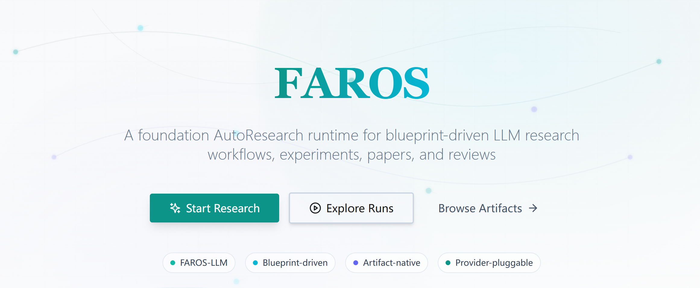
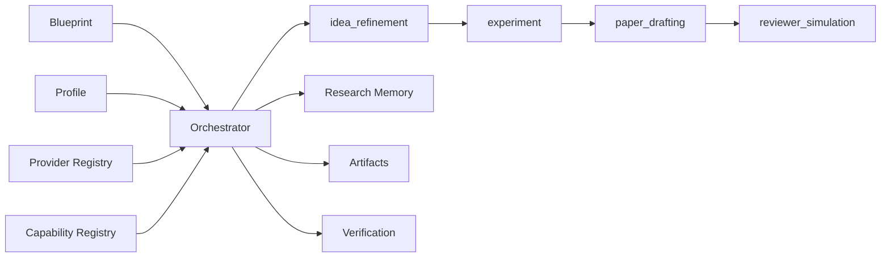

<p align="center">
  <h1 align="center">FAROS</h1>
  <p align="center"><b>Foundation AutoResearch Operating System</b></p>
  <p align="center"><i>Blueprint-driven AutoResearch runtime for the LLM domain today, extensible research workflows tomorrow.</i></p>
</p>

<p align="center">
  
  
  
  
  
  
</p>

<p align="center">
  <a href="#-release-scope">Release Scope</a> ·
  <a href="#-why-faros">Why FAROS</a> ·
  <a href="#-current-workflow">Workflow</a> ·
  <a href="#-architecture">Architecture</a> ·
  <a href="#-quick-start">Quick Start</a> ·
  <a href="#-faros-api">API</a> ·
  <a href="#-important-todo">TODO</a>
</p>


---

> [!IMPORTANT]
> FAROS is not a single hardcoded AI scientist agent. It is a research workflow runtime built around **Blueprints**, **Capabilities**, **Profiles**, and **Providers**.
>
> This release ships the first runnable baseline: **FAROS-LLM**.

## ✨ Tagline

<p align="center">
  <b><i>Define a research workflow. Bind a profile. Run an AutoResearch system.</i></b>
</p>

<p align="center">
  <code>idea -> experiment -> paper -> review</code>
</p>


<p align="center">
  
</p>

---

## 📦 Release Scope

This repository is the current release candidate for the **LLM-domain FAROS baseline**.
It is already a runnable AutoResearch runtime, but it is not yet the final cross-domain platform vision.

<table>
<tr>
<td width="50%" valign="top">

### Included

- FAROS runtime under `backend/app/faros`
- Blueprint loading and profile loading
- Capability and provider registries
- File-backed run, event, artifact, and memory persistence
- First blueprint: `ml_paper`
- First profile: `faros_llm`
- Complete LLM workflow: `idea -> experiment -> paper -> review`
- Existing module-native APIs for `idea`, `code`, `paper`, `review`, `platform`
- Venue-aware LaTeX paper generation

</td>
<td width="50%" valign="top">

### Not Yet Included

- full DAG scheduling and parallel orchestration
- generalized non-LLM provider ecosystem
- full experiment execution and evaluation loop
- FAROS frontend console
- DB-backed FAROS runtime metadata
- mature cross-domain blueprint library

</td>
</tr>
</table>

---

## 🤔 Why FAROS

Most "AI scientist" systems are built as one fixed application with one workflow and one set of assumptions.
FAROS takes a different approach: treat research automation as a **runtime problem**, not a single-agent prompt stack.

<table>
<tr><th width="24%">Layer</th><th>Responsibility</th></tr>
<tr><td><b>Blueprint</b></td><td>Defines the workflow graph, constraints, output contract, and validation requirements.</td></tr>
<tr><td><b>Capability</b></td><td>Implements one executable research step such as idea refinement, experiment provisioning, paper drafting, or reviewer simulation.</td></tr>
<tr><td><b>Profile</b></td><td>Binds a blueprint to a concrete execution strategy.</td></tr>
<tr><td><b>Provider</b></td><td>Supplies the actual engine behind a capability, such as LLM, tool, API, or human review.</td></tr>
</table>

> [!NOTE]
> In FAROS, LLM is only one provider class. This release ships `FAROS-LLM`, but the runtime is being shaped so future domains can plug in other providers without rewriting the core orchestration layer.

---

## 🚀 What Makes This Release Different

<table>
<tr><th width="24%">Principle</th><th>How This Release Applies It</th></tr>
<tr><td><b>Keep What Works</b></td><td>The current `idea`, `code`, `paper`, `review`, and `platform` modules are reused through FAROS capability adapters instead of being replaced by a second parallel application.</td></tr>
<tr><td><b>Add a Runtime Boundary</b></td><td>New orchestration logic lives under `backend/app/faros`, giving memory, verification, profiles, and providers a stable place to evolve.</td></tr>
<tr><td><b>Finish One Domain First</b></td><td>The first complete chain is the LLM research domain. Cross-domain abstraction comes after the first workflow is coherent and runnable.</td></tr>
</table>

---

## 🔄 Current Workflow

The first FAROS blueprint is `ml_paper`.

<table>
<tr><th width="18%">Stage</th><th width="22%">Capability</th><th>Output</th></tr>
<tr><td>1</td><td><code>idea_refinement</code></td><td>Idea session, ranked candidates, selected candidate</td></tr>
<tr><td>2</td><td><code>experiment</code></td><td>Code project scaffold and experiment record for the LLM domain</td></tr>
<tr><td>3</td><td><code>paper_drafting</code></td><td>Venue-aware LaTeX project, PDF, and paper artifacts</td></tr>
<tr><td>4</td><td><code>reviewer_simulation</code></td><td>Structured review plus actionable follow-up items</td></tr>
</table>

### Current Artifact Surface

<table>
<tr><th width="22%">Artifact Type</th><th>Description</th></tr>
<tr><td><code>idea_session</code></td><td>Idea generation session with ranked candidate outputs</td></tr>
<tr><td><code>code_project</code></td><td>Provisioned research code workspace for the experiment stage</td></tr>
<tr><td><code>experiment_record</code></td><td>Experiment metadata record for the LLM workflow</td></tr>
<tr><td><code>latex_project</code></td><td>Paper source bundle with venue-aware LaTeX assets</td></tr>
<tr><td><code>paper_pdf</code></td><td>Compiled paper PDF or fallback rendered PDF</td></tr>
<tr><td><code>review_report</code></td><td>Structured review with action items</td></tr>
</table>

---

## 🏗️ Architecture

```text
backend/app/
  faros/
    api/
    blueprints/
    capabilities/
    loaders/
    memory/
    models/
    profiles/
    providers/
    registry/
    runtime/
    verification/
  modules/
    idea/
    code/
    paper/
    review/
    platform/
```

### Runtime Layers

<table>
<tr><th width="24%">Area</th><th>Role</th></tr>
<tr><td><b>FAROS Runtime</b></td><td>Blueprint loading, capability registry, profile binding, orchestrated execution, event logging, artifact persistence, research memory, and baseline verification</td></tr>
<tr><td><b>Domain Modules</b></td><td>Reusable implementation surfaces for `idea`, `code`, `paper`, `review`, and `platform`</td></tr>
</table>

### Execution Model



---

## 🗂️ Repository Layout

```text
github-v1/
  backend/
    app/
      faros/
      modules/
      llm/
      db/
      storage/
    templates/latex/
    tests/
  frontend/
    src/
  docs/
    DEVELOPER_GUIDE.md
    FAROS_TODO.md
```

---

## ⚙️ Runtime Requirements

- Python `3.11+` or `3.12`
- Node.js `18+`
- `latexmk` and `pdflatex` for venue-style PDF compilation
- a configured LLM provider for real execution

> [!TIP]
> The development environment used during this release cycle has been the conda environment `aist`.

---

## 🚀 Quick Start

### Backend

```bash
cd backend
pip install -r requirements.txt
uvicorn app.main:app --host 127.0.0.1 --port 8005 --reload
```

### Frontend

```bash
cd frontend
npm install
npm run dev
```

### Useful Endpoints

<table>
<tr><th width="34%">Endpoint</th><th>Purpose</th></tr>
<tr><td><code>GET /api/system/health</code></td><td>Basic backend health</td></tr>
<tr><td><code>GET /api/system/version</code></td><td>Release metadata</td></tr>
<tr><td><code>GET /api/docs</code></td><td>OpenAPI docs</td></tr>
<tr><td><code>GET /api/faros/health</code></td><td>FAROS runtime health</td></tr>
<tr><td><code>GET /api/faros/blueprints</code></td><td>Available FAROS blueprints</td></tr>
<tr><td><code>GET /api/faros/profiles</code></td><td>Available FAROS profiles</td></tr>
</table>

If needed, set `VITE_API_BASE_URL` for the frontend.

---

## 🔐 Provider Configuration

The backend supports multiple providers, including `minimax`.

Configuration is loaded from:
1. environment variables defined in `backend/app/core/settings.py`
2. runtime settings persisted to `backend/data/provider_config.json`

Do not commit real API keys.

---

## 🔌 FAROS API

<table>
<tr><th width="38%">Endpoint</th><th>Purpose</th></tr>
<tr><td><code>GET /api/faros/health</code></td><td>Runtime health and asset counts</td></tr>
<tr><td><code>GET /api/faros/blueprints</code></td><td>List available blueprints</td></tr>
<tr><td><code>GET /api/faros/profiles</code></td><td>List available profiles</td></tr>
<tr><td><code>GET /api/faros/capabilities</code></td><td>List registered capabilities and providers</td></tr>
<tr><td><code>GET /api/faros/runs</code></td><td>List FAROS runs</td></tr>
<tr><td><code>POST /api/faros/runs</code></td><td>Create a FAROS run</td></tr>
<tr><td><code>GET /api/faros/runs/{run_id}</code></td><td>Inspect one FAROS run</td></tr>
<tr><td><code>GET /api/faros/runs/{run_id}/events</code></td><td>Inspect run events</td></tr>
<tr><td><code>GET /api/faros/runs/{run_id}/artifacts</code></td><td>Inspect run artifacts</td></tr>
</table>

### Example: Plan-Only Run

```bash
curl -X POST http://127.0.0.1:8005/api/faros/runs   -H 'Content-Type: application/json'   -d '{
    "blueprintId": "ml_paper",
    "profileId": "faros_llm",
    "executionMode": "plan",
    "inputs": {
      "seedQuery": "Improve CPU efficiency in LLM workflows",
      "paperType": "system",
      "targetVenue": "generic"
    }
  }'
```

---

## 📝 Paper Generation

Paper generation in this release uses real venue-aware LaTeX template assets.

<table>
<tr><th width="22%">Template</th><th>Description</th></tr>
<tr><td><code>icml</code></td><td>ICML-style LaTeX template path</td></tr>
<tr><td><code>neurips</code></td><td>NeurIPS-style LaTeX template path</td></tr>
<tr><td><code>iclr</code></td><td>ICLR-style LaTeX template path</td></tr>
<tr><td><code>acl</code></td><td>ACL-style LaTeX template path</td></tr>
<tr><td><code>generic</code></td><td>Fallback generic template</td></tr>
</table>

Compilation prefers `latexmk`.
If LaTeX compilation fails, the backend falls back to simplified PDF rendering so the workflow still yields a previewable artifact.

---

## ✅ Verification

### Release Checks

```bash
bash scripts/check_release.sh
```

```bash
bash backend/scripts/check_backend_release.sh
```

```bash
bash frontend/scripts/check_frontend_release.sh
```

### Current Validation State

- `github-v1/backend/tests` in `aist`: `10 passed`
- FAROS runtime routes mounted
- plan-mode FAROS run creation verified
- LLM-domain FAROS workflow skeleton wired through `idea -> experiment -> paper -> review`

---

## 🧱 Stable Surface In This Release

These parts should be treated as the release baseline:

<table>
<tr><th width="30%">Area</th><th>Stability Statement</th></tr>
<tr><td><code>backend/app/faros/*</code></td><td>Primary runtime surface for future FAROS work</td></tr>
<tr><td>Blueprint/Profile loading</td><td>Stable release baseline</td></tr>
<tr><td>FAROS metadata API</td><td>Stable release baseline</td></tr>
<tr><td>Plan-mode FAROS run creation</td><td>Stable release baseline</td></tr>
<tr><td>Provider settings path</td><td>Stable release baseline</td></tr>
<tr><td>Paper generation path</td><td>Stable release baseline</td></tr>
<tr><td>Review generation path</td><td>Stable release baseline</td></tr>
</table>

---

## 📌 Important TODO

The most important next steps after this release are:
- replace the current `experiment` scaffold with true code synthesis and execution for the LLM domain
- connect experiment outputs to metrics ingestion, figure generation, and run tracking
- replace linear graph execution with a real DAG runtime
- add stronger verification beyond required-key checks
- add a dedicated FAROS frontend console
- add provider inheritance policies instead of hardcoded profile defaults

See [docs/FAROS_TODO.md](docs/FAROS_TODO.md) for the detailed backlog.

---

## 🛠️ Development Notes

Use [docs/DEVELOPER_GUIDE.md](docs/DEVELOPER_GUIDE.md) for module ownership, extension boundaries, and development conventions.

Current working rule:
- extend FAROS under `backend/app/faros`
- keep domain-specific logic inside `backend/app/modules/*`
- avoid adding new business logic to legacy compatibility paths unless required for release stability

---

## 📍 Project Status

This repository is the first FAROS release candidate.
It is already usable as a runtime baseline for LLM-domain AutoResearch workflows, but it is still the beginning of the platform transition rather than the end state.
